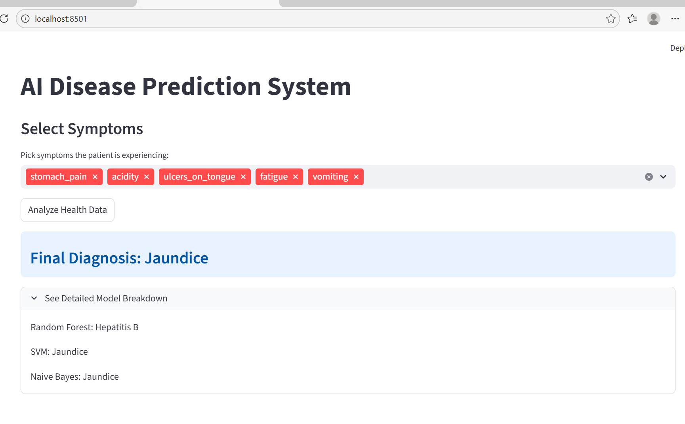

# 🏥 Web AI Healthcare – AI Disease Prediction System

An AI-powered web application that predicts possible diseases based on selected symptoms using Machine Learning models.

---

## 🚀 Features

- 🔍 Symptom-based disease prediction
- 🤖 Multiple ML models (Random Forest, SVM, Naive Bayes)
- 📊 Model breakdown comparison
- 📈 Probability-based prediction (if implemented)
- 🧠 Ensemble-style decision making
- 🌐 Interactive web interface
- ⚠ Medical disclaimer included

---

## 🛠 Tech Stack

### 💻 Frontend
- Streamlit app / Flask 

### 🧠 Backend
- Python
- Scikit-learn
- Pandas
- NumPy

### 🤖 Machine Learning Models
- Random Forest
- Support Vector Machine (SVM)
- Naive Bayes

## 📸 Project Preview

